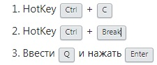
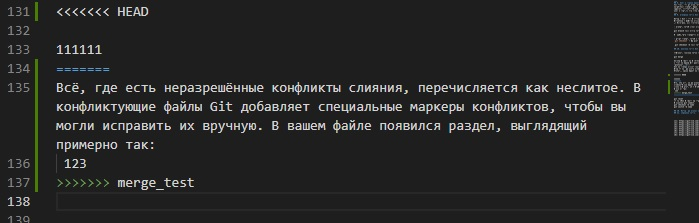

# Работа с **Git**  <br/>

## 1. Проверка наличия установленного Git
В терминале выполнить команду `git version`.

Если Git установлен, появится сообщение с информацией о версии программы. Иначе выведется сообщение об ошибке.
___

## 2. [Установка Git.][1]
Загружаем последнюю версию Git с [сайта][1]. Устанавливаем с настройкаим по умолчанию.
___

## 3. Настройка Git.
При первом использовании Git необходимо представиться. Для этого в терминале нужно выполнить две комманды:
```
git config --global user.name "Ваше имя английскими буквами"    
git config --global user.email Ваша почта@example.com
```
___
## 4. [Инициализация репозитория.][2]
- Для создания нового репозитория используется команда `git init`.   
Большинство остальных команд Git невозможно использовать без инициализации репозитория, поэтому данная команда обычно выполняется первой в рамках нового проекта.
```
Git init
```
- Клонировать существующий репозиторий Git из любого места. Сделать это можно так:
```
Git clone <адрес репозитория>
```
___
## 5. [Запись изменений в репозиторий.][3]
### _Команда_
```
Git status
```
_[Git status][3] Показывает состояния файлов в рабочем каталоге и индексе_: какие файлы изменены, но не добавлены в индекс; какие ожидают коммита в индексе. Вдобавок к этому выводятся подсказки о том, как изменить состояние файлов.

### _Команда_
```
git add <file name>
```
_[Git add][4] это первая команда в цепочке операций, предписывающей Git «сохранить» снимок текущего состояния проекта в истории коммитов._<br/>
В случае если у вас много файлов для добавления, можно воспользоваться командой
```
git add .
```

### _Команда_
```
git commit
```
`Коммиты` — _основные конструктивные элементы временной шкалы проекта Git. Их можно рассматривать как снимки состояния или контрольные точки на временной шкале проекта Git._<br/>[Git commit][5] откроет текстовый редактор с предложением ввести комментарий к коммиту. После ввода комментария сохраните файл и закройте текстовый редактор, чтобы выполнить коммит.

```
git commit -a
```
Выполнение коммита состояния со всеми изменениями в рабочем каталоге. Эта команда включает только изменения отслеживаемых файлов (тех, которые были в какой-то момент добавлены в историю с помощью команды `git add`).

```
git commit -m "commit message"
```
При передаче параметра -m текстовый редактор не открывается, а используется подставленный комментарий.

```
git commit -am "commit message'
```
Эта комбинация параметров `-a` и `-m` создает коммит всех проиндексированных изменений и добавляет к коммиту комментарий.
```
git commit --amend
```
Добавление изменений в предыдущий коммит и вызов текстового редактора с предложением изменить указанный ранее комментарий к коммиту.

### _Команда_
[Git diff][6]
_используется для вычисления разницы между любыми двумя Git деревьями._<br/>
По умолчанию выводит все неподтвержденные изменения, внесенные после последнего коммита
```
git diff
```
или между любыми двумя коммитами.
```
git diff master branchB
```
___
## 6. Просмотр истории коммитов.
```
git log
```
_[Git log][7] выводит список коммитов созданных в данном репозитории в обратном хронологическом порядке. То есть самые последние коммиты показываются первыми._<br/>Что бы вывести сокращенную версию логов:
```
Git log --oneline
```

Чтобы выйти из просмотра логов:


___
## 7. Перемещение между сохранениями.
```
git checkout
```
[Git checkout][8] Используется для переключения веток и выгрузки их содержимого в рабочий каталог.
___
## 8. [Игнорирование файлов.][9]
Для того, что бы исключить из отслеживания в репозитории файлы и папки необходимо создать файл `.gitignore` и записать в него их названия или шаблоны, соответствующие таким файлам `<*.<расширение>>` и папкам(будет игнорироваться все содержимое папки) `</folder>`.
___
## 9. [Создание веток Git.][10]

### Ветка в Git - это простой перемещаемый указатель на один из коммитов, обычно последний в цепочке коммитов.
По умолчанию имя основной ветки в Git - master.

- Создать ветку можно командой:
```
git branch <имя новой ветки>
```
В результате создается новый указатель на текущий коммит.

- Чтобы создать ветку и сразу переключиться на нее, можно выполнить команду `git checkout` с параметром `-b`:
```
 git checkout -b <имя ветки>
```
### Разница между `git checkout` и `git switch`.

`Git checkout` – это старая команда, которая использовалась для создания и переключения веток. Она также может использоваться для восстановления изменений с определенного коммита.

Но git checkout делает больше.

Она позволяет копировать файлы из любой ветки или коммита прямо в ваше рабочее дерево, не переключая ветки.

Просто помните, что git checkout делает больше, чем простое переключение веток, и дополнительные функции начали создавать путаницу.

Поэтому с выходом Git 2.23 его разработчики представили две новые команды git: `git switch` и `git restore`.

Идея этого шага заключается в том, чтобы позволить людям использовать `git switch` для переключения веток, а `git restore` – для отмены изменений после коммита.

## 10. [Слияние веток Git][10]

выполнить слияние ветки с веткой master можно командой 
```
git merge <имя ветки>
```
Иногда процесс не проходит гладко. Если вы изменили одну и ту же часть одного и того же файла по-разному в двух объединяемых ветках, Git не сможет их чисто объединить.<br/> 
Git не создал коммит слияния автоматически. Он остановил процесс до тех пор, пока вы не разрешите конфликт. Чтобы в любой момент после появления конфликта увидеть, какие файлы не объединены, вы можете запустить `git status`.


Всё, где есть неразрешённые конфликты слияния, перечисляется как неслитое. В конфликтующие файлы Git добавляет специальные маркеры конфликтов, чтобы вы могли исправить их вручную. В вашем файле появился раздел, выглядящий примерно так:




## 11. [Удаление веток.][11]
 
 Чтобы удалить локальную ветку, мы можем использовать `git branch` команду с `-d` или же `-D` вариант.
```
git branch (-d | -D) <имя ветки>
```
- `-d` сокращение для `--delete`, который удаляет ветвь только в том случае, если она была полностью объединена с вышестоящей ветвью.
```
git branch -d <имя ветки>
```
- `-D` сокращение это псевдоним для `--delete --force`, которые позволяют удалять ветку независимо от ее статуса слияния.
```
git branch -D <имя ветки> "-D тоже что -d -f"
```
- Чтобы удалить удаленные ветки с помощью `git branch` команды, укажите `-r` вариант вместе с `-d` вариант.
```
git branch -d -r <имя ветки>
```
- Что бы увидеть список удаленных веток ветки используется ключ `-r`
```
git branch -r
```
- Для вывода всех веток, локальных и удаленных, используется ключ `-a`
```
git branch -a
```


[1]: https://git-scm.com/downloads
[2]: https://git-scm.com/docs/git-init
[3]: https://git-scm.com/docs/git-status
[4]: https://git-scm.com/docs/git-add
[5]: https://git-scm.com/docs/git-commit
[6]: https://git-scm.com/docs/git-diff
[7]: https://git-scm.com/docs/git-log
[8]: https://git-scm.com/docs/git-checkout
[9]: https://git-scm.com/docs/gitignore
[10]: https://git-scm.com/book/ru/v2/%D0%92%D0%B5%D1%82%D0%B2%D0%BB%D0%B5%D0%BD%D0%B8%D0%B5-%D0%B2-Git-%D0%9E%D1%81%D0%BD%D0%BE%D0%B2%D1%8B-%D0%B2%D0%B5%D1%82%D0%B2%D0%BB%D0%B5%D0%BD%D0%B8%D1%8F-%D0%B8-%D1%81%D0%BB%D0%B8%D1%8F%D0%BD%D0%B8%D1%8F
[11]: https://www.techiedelight.com/ru/delete-git-local-remote-branches/